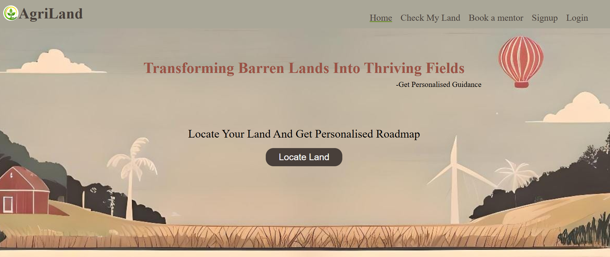
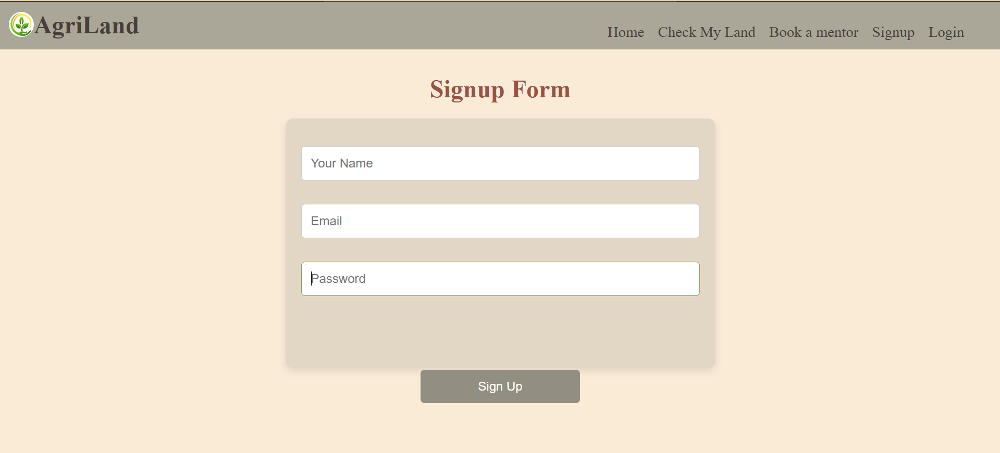
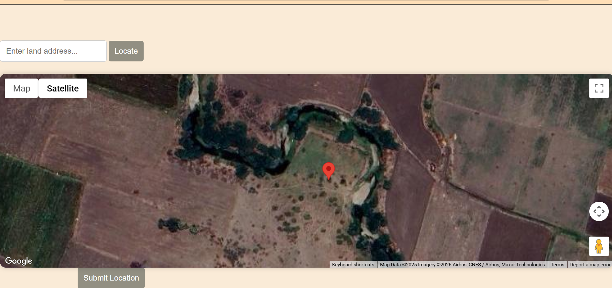
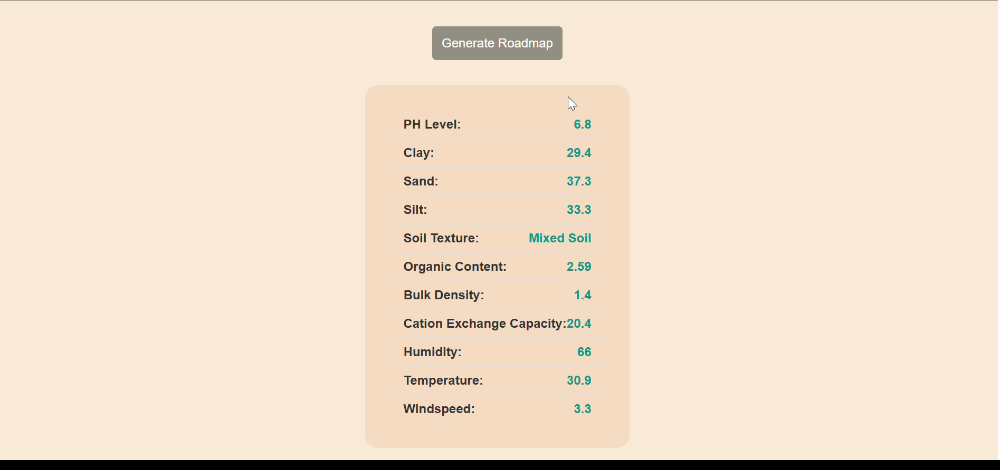
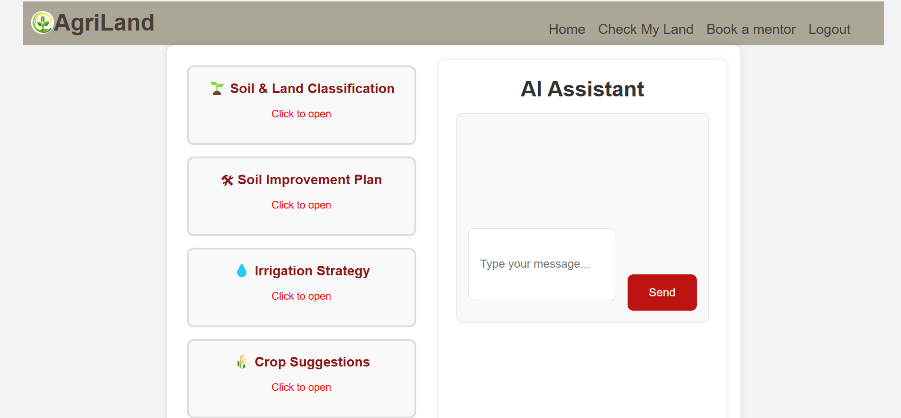
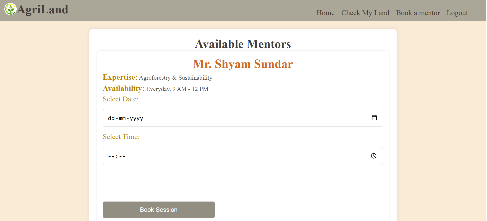

#  AgriLand - Barren Land to Cultivable Land Conversion 

AgriLand is a smart web application designed to assist in improving all types of agricultural lands — from barren lands to low-yield or underutilized lands — by using satellite data, soil analysis, real-time climate conditions, and AI-generated solutions.

The platform empowers users by providing expert recommendations, mentorship sessions, and personalized improvement roadmaps based on their selected land coordinates. Whether you're looking to reclaim barren land or enhance fertile fields, AgriLand supports sustainable and data-driven agricultural practices.

##  Project Highlights

- 📍 Google Maps Integration for land selection
- 🧪 Soil analysis using SoilGrids API
- ☁️ Real-time weather data from Tomorrow.io API
- 🌾 NDVI, land cover, precipitation, slope & elevation data via Google Earth Engine (GEE)
- 🤖 AI-powered suggestions using Gemini API
- 👨‍🏫 Mentor booking system to connect with agricultural experts
- 🔐 Firebase Authentication & Firestore integration for secure user experience
-    Gemini AI Assistance to help user to get more information about their land

---

## 🛠️ Tech Stack

- Frontend: HTML, CSS, JavaScript, EJS Templates
- Backend:Node.js, Express.js
- Database: Firebase Firestore
- Authentication: Firebase Authentication
- Session Storage:Firestore-based Sessions
- APIs Used:
  - SoilGrids API (soil properties)
  - Tomorrow.io (weather & climate)
  - Google Earth Engine (NDVI, land cover, etc.)
  - Gemini API (soil improvement suggestions)
- Hosted on render

---

## 🧠 Features

### 🌍 Land Selection
- Users can select a location on the map.
- javascript geoloaction fetches the coordinates of the land choosen.
- Coordinates are submitted for analysis.
- If they click on submit location button without choosing location on map ,then their current device location coordinates(lat , long) are submitted.

### 🧪 Soil & Climate Analysis
- Fetch soil data using the SoilGrids API.
- Fetch weather/climate conditions using Tomorrow.io API.
- Extract land-related data from Google Earth Engine (NDVI, slope, elevation, etc.).

### 📊 Results Dashboard
- Displays all analyzed data visually on `soilgrids.ejs` and `gemini.ejs`.

### Google AI Assistant
- Gemini ai assistant to communicate with users

### 🧑‍🏫 Mentorship Booking
- View available mentors on `mentor.ejs`.
- Book a session by selecting date & time.
- Mentor and session info stored in Firestore.

### 🔐 Authentication & Sessions
- User authentication handled by Firebase Auth.
- Secure session storage using Firestore-based sessions.

---

## 📁 Folder Structure
AgriLand/
├── config/          # Firebase and Google Earth Engine setup
├── modules/         # Optional datasets (NDVI, temperature, slope, etc.)
├── public/          # Static assets (CSS, JS, images)
├── routers/         # Express route handlers
├── utils/           # Middleware, session store, error handling
├── views/           # EJS templates for frontend
├── .gitattributes
├── .gitignore
├── LICENSE
├── README.md
├── script.js        # Main Express backend entry point

## Screenshots

### 🏠 Homepage

---

### 📝 Signup Page

---

### 🗺️ Land Location Selection

---

### 🧪 Soil Data Result

---

### 🧾 Final Results Page

---

### 🧑‍🏫 Mentor Booking Page

## 🎯 Future Improvements
   - AI-based crop prediction
  - Fertilizer calculator tool
  - Land monitoring alerts
  - Chat-based mentor sessions
  - Community forum for farmers so that they can share their results and 
   opinions
  - AI-model training using historical data
  - Mobile app integration
  - IOT and Real time monitoring
  - Progress Tracking
  - Government and NGO Parternships
  - Multilingual support 

## 💬 Project Purpose
  - AgriLand helps landowners and farmers make informed decisions about land reclamation by analyzing land data and 
   suggesting affordable solutions. It also connects them with mentors for guidance, fostering sustainable agriculture 
   practices.

## 🔗 Live Demo
[Visit AgriLand](https://agriland.onrender.com/))

## 🎥 Demo Video
[Watch Demo](https://youtu.be/UdzBB2wg0Mo?si=ifp0Wm7d034lCxxv)

## 🧪 Run Locally

1. Clone the repository:
   https://github.com/swathi2006/AgriLand.git

2. Install dependencies:
   npm install

3. Add your Firebase and API config in `/config` folder.

4. Start the server:
   node script.js
   

## 🙌 Acknowledgements
A huge shoutout to all the amazing open-source tools, APIs, mentors, and communities that helped shape AgriLand into reality.
Built with 💚, code, and lots of coffee by Swathi for the Google Solution Challenge 2025.
let’s make barren lands bloom again 🌱✨

